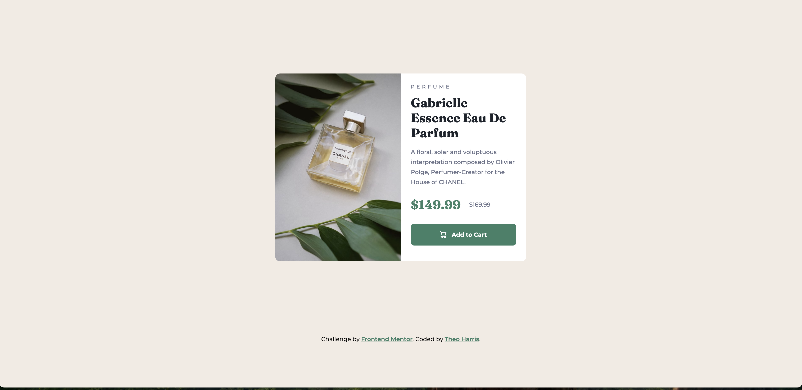

# Frontend Mentor - Product preview card component solution

This is a solution to the [Product preview card component challenge on Frontend Mentor](https://www.frontendmentor.io/challenges/product-preview-card-component-GO7UmttRfa). Frontend Mentor challenges help you improve your coding skills by building realistic projects.

## Table of contents

- [Overview](#overview)
  - [The challenge](#the-challenge)
  - [Screenshots](#screenshots)
  - [Links](#links)
- [My process](#my-process)
  - [Built with](#built-with)
  - [What I learned](#what-i-learned)
- [Author](#author)

## Overview

### The challenge

Users should be able to:

- View the optimal layout depending on their device's screen size
- See hover and focus states for interactive elements

### Screenshots

### Links

- [Challenge Solution](https://www.frontendmentor.io/solutions/product-preview-card-4YbAKjM8CN)
- [Live Site](https://theosaurus-rex.github.io/frontend-mentor-product-preview/)

## My process

### Built with

- Semantic HTML5 markup
- Tailwind CSS

### What I learned

Using a `<s>` or `<del>` tag doesn't necessarily announce to screen reader users that the element has been deleted or is no longer relevant. I added an `aria-label` to remedy this, but not sure if this is the best way to indicate the old price to users of assistive technology.

## Author

- Website - [Theo Harris](https://theo-harris-dev.com/)
- Frontend Mentor - [@Theosaurus-Rex](https://www.frontendmentor.io/profile/Theosaurus-Rex)
- Bluesky - [@theosaurus-rex.bsky.social](https://bsky.app/profile/theosaurus-rex.bsky.social)
